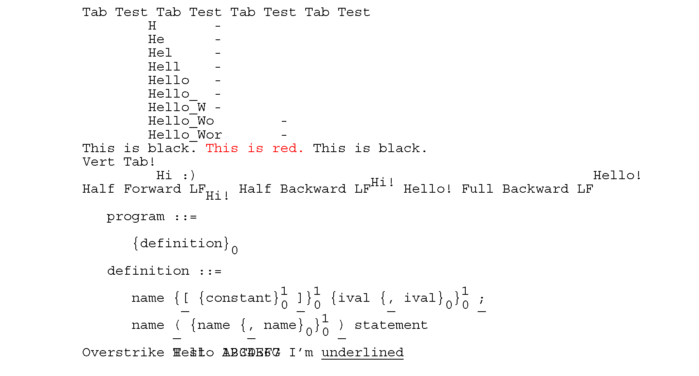

# Teletype 37 PDF
Teletype Model 37 emulation with PDF output. Pretty crude and inflexible at the current stage, however good enough to typeset most UNIX roff(1) documents.

## Usage
```
genpdf.py <input> <output>
```

If `<input>` is `-`, the standard input is used. This allows `genpdf.py` to be used with roff(1) like `roff $1 | genpdf.py - $1.pdf`.

## Layout
- Letter sized paper (8.5 x 11 inch)
- 65 characters per line (with 1-inch margin)
- 66 lines per page

## Key Features
- Red Text
- Black Text
- Reverse Line Feed
- Half Reverse Line Feed
- Half Line Feed
- Backspace
- Overstriking
- Carriage Return
- Line Feed (automatically replaced with CRLF)
- Form Feed
- Horizontal Tab (8 spaces)
- Vertical Tab (1 line)

## Example

